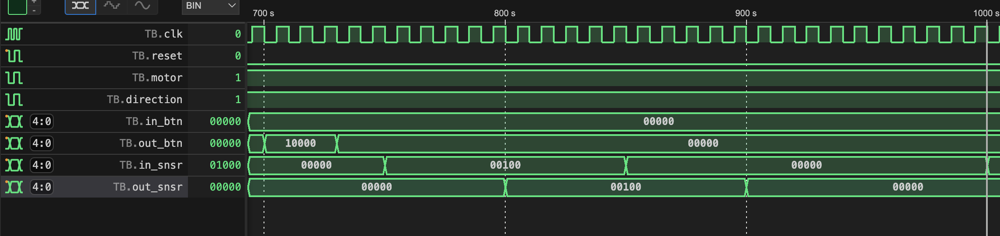

# DSD Project

In this project, we implement elevator in verilog and test its performance on a senario.

## Implementation

We implemented an elevator for a house with four floors and one lobby, so there are 5 different states for our elevator.

### Inputs and outputs

- `in_btn`: There are 5 buttons, one button for each floor to request the elevator.
- `out_btn`: Inside the elevator there are 5 buttons, one for each floor to request exitting the elevator.
- `in_snsr`/`out_snsr`: For each floor, there is an input sensor, and an output sensor. When both sensors are active, the elevator will stop on that floor.
- There is a signal for the movement direction of the elevator and a signal for the motor. We named them `direction`(0=down/1=up) and `motor`(0=off/1=on), respectively. Note that when motor is off, the value of direction is not important.

### Details

We set the time for stopping in a floor, $1000$, pressing a button $30$, and moving one floor $100$. We handled stopping the elevator when reaching the final floor (first or last). The clock cycle is $10$.

## Senario

We test our module by introducing a challenging senario:

### Level 0: Reseting the elevator

First of all, we reset all variables to 0 and stop the elevator at lobby.

### Level 1: Out button 3 pressed

A person in floor 3 pressed the button, so the elevator would be on and move upward.

### Level 2: Pass one floor

### Level 3: Out button 4 pressed

One person in floor 4 pressed the button. The elevator will stop first at floor 3, after that, it will go one floor upward.

### Level 4: Reach floor 3

In this level, the elevator should wait for $1000$ time units to let people in.

### Level 5: In button 0 (lobby) pressed

People that get in last level, want to go lobby, but first the elevator should go to floor 4, because the request is earlier.

### Level 6: Reach floor 4

In this level, the elevator should wait for $1000$ time units because there was a request on this floor.

### Level 7: Go down

The motor is on and the elevator is going downward.

### Level 8: In button 1 pressed

Someone in the elevator wants to get out in floor 1. Because floor 1 and lobby are in the same direction, the elevator will first stop at floor one.

### Level 9: Reach floor 1

The elevator will be off for $1000$. After that it will be on to go downward (lobby).

### Level 10: Reach lobby

Finally, the elevator stops at lobby.

And this is the end of our senario :).

### Author

[Mohammad Shafizadeh](https://github.com/fraxea) (**401 110 386**)
